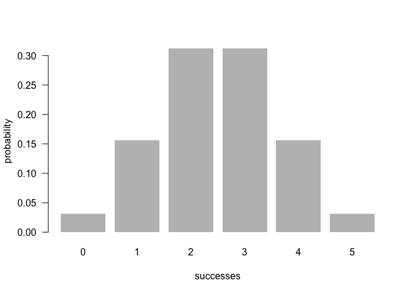
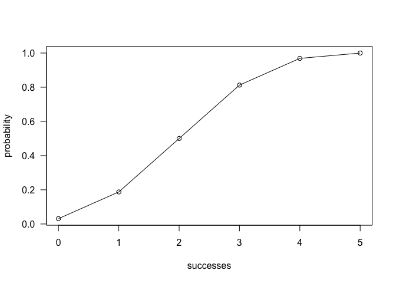

README
================

<!-- README.md is generated from README.Rmd. Please edit that file -->
Overview
--------

`"binomial"` is an R package that lets the user calculate and display the properites of the binomial distribution and variable. Functions include:

-   `bin_choose()` finds the number of ways to choose k items from n
-   `bin_probability()` finds the probability of a particular number of successes
-   `bin_distribution()` creates a `"bindis"` and `"data.frame"` object that can be visualized with `plot()`
-   `bin_cumulative()`creates a `"bincum"` and `"data.frame"` object that can be visualized with `plot()`
-   `bin_variable()` creates a `"binvar"` object that can be summarized with `summary()`
-   `bin_mean()` finds the mean
-   `bin_variance()` finds the variance
-   `bin_mode()` finds the mode
-   `bin_skewness()` finds the skewness
-   `bin_kurtosis()` finds the kurtosis

Motivation
----------

This package was developed to learn the basics of creating a package. The binomial distribution is a simple concept to implement in code, so it is great for learning as a proof of concept.

Installation
------------

Install the development version from GitHub via the package `"devtools"`:

``` r
# development version from GitHub:
#install.packages("devtools") 
# install "binomial" (without vignettes)
devtools::install_github("hw-stat133-zishenyoo/binomial")
# install "binomial" (with vignettes)
devtools::install_github("hw-stat133-zishenyoo/binomial", build_vignettes = TRUE)
```

Usage
-----

``` r
library(binomial)
```

### Binomial Functions:

``` r
# number of combinations of getting 2 successes in 5 trials
bin_choose(n = 5, k = 2)
#> [1] 10


# probability of getting 2 successes in 5 trials
bin_probability(success = 2, trials = 5, prob = 0.5)
#> [1] 0.3125


# object of class "bindis"
dis1 <- bin_distribution(trials = 5, prob = 0.5)


# histogram of binomial distribution
plot(dis1)
```



``` r

# object of class "bincum"
dis2 <- bin_cumulative(trials = 5, prob = 0.5)

plot(dis2)
```



``` r

bin1 <- bin_variable(trials = 10, p = 0.3)

summary(bin1)
#> "Summary Binomial"
#> 
#> Parameters
#> - number of trials: 10 
#> 
#> - prob of success : 0.3 
#> 
#> Measures
#> 
#> - mean    : 3 
#> 
#> - variance: 2.1 
#> 
#> - mode    : 3 
#> 
#> - skewness: 0.2760262 
#> 
#> - kurtosis: -0.1238095
```

Summary Measures:

``` r
#> trials: 10
#> probability of success: 0.3 

bin_mean(10, 0.3)
#> [1] 3


bin_variance(10, 0.3)
#> [1] 2.1

bin_mode(10, 0.3)
#> [1] 3

bin_mode(7, 0.5)
#> [1] 4


bin_skewness(10, 0.3)
#> [1] 0.2760262


bin_kurtosis(10, 0.3)
#> [1] -0.1238095
```

Author Information
------------------

-   Author: Zishen Liu
-   Email: <zishenliu@berkeley.edu>
-   School: UC Berkeley
-   Class: Stat 133 (Section 105)
-   Instructor: Gaston Sanchez
