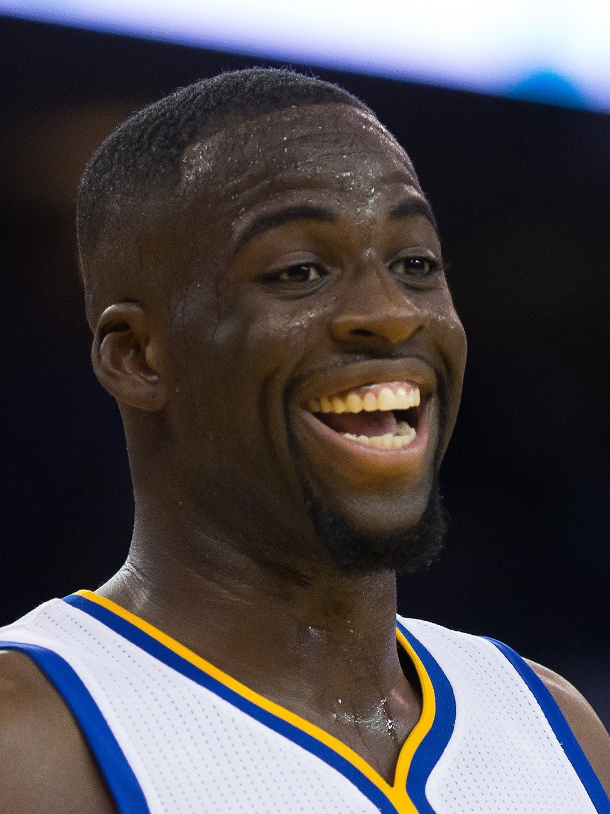

```{r}
library(dplyr)

```

```{r}
shots_data <-read.csv("../data/shots-data.csv", stringsAsFactors = FALSE)
x<- select(shots_data, c('name','shot_made_flag','shot_type'))
```


```{r}
twoptshots <- x[x$shot_type=="2PT Field Goal",] %>%
  group_by(name) %>%
  dplyr::summarise(total = n(), made = sum(shot_made_flag == "shot_yes"), percentage = made/total*100) %>%
  arrange(desc(percentage))
```

```{r}
threeptshots <- x[x$shot_type=="3PT Field Goal",] %>%
  group_by(name) %>%
  dplyr::summarise(total = n(), made = sum(shot_made_flag == "shot_yes"), percentage = made/total*100) %>%
  arrange(desc(percentage))
```


```{r}
allshots <- x %>%
  group_by(name) %>%
  dplyr::summarise(total = n(), made = sum(shot_made_flag == "shot_yes"), percentage = made/total*100) %>%
  arrange(desc(percentage))
```

# Narrative

## Shooting Analysis of Five Golden State Legendary Warriors
```{r out.width='50%', echo = FALSE, fig.align='center'}
knitr::include_graphics('../images/GSW1.jpg')
```

Who is the best basketball Team in National Basketball Association (NBA)? 
If you ask this question in the Bay Area, the answer you will most likely hear is the Golden State Warriors. As a member of the league's Western Conference Pacific Division, the Golden State Warriors(GSW) is a prominent American professional basketball team based in Oakland, California and plays their home games at the Oracle Arena. Founded in 1946 in Philadelphia, the Warriors relocated to the San Francisco Bay Area in 1962 and took the city's name, before changing its geographic moniker to Golden State in 1971. 

Despite of the history of Golden State Warriors, the team definitley reached its golden era in 2016. If witnessing the 2016 season of GSW is already a huge honor for the general public, players who play for the Golden State Warriors at that season must be extraodinary. Among these amazing players, five players are considered to be lengendary.They are Andre Iguodala, Kevin Durant, Stephen Curry, Klay Thompson and Draymond Green. However, among these five, who is relatively the worst? If you ask this question to the people on the street, you might hear all kind of answers. This following analysis takes account only the shooting datas and it try to answer the following question: If we only look at the shooting records, who will be the worst? 

Let's figure that out through conducting analysis on the shooting datas of these five people, and compare their shooting patterns. 

|name          |total   |   made| percentage|
|--------------|:-----:| -----:|-------:|
|Kevin Durant  |  915  | 495    |   54.1|
|Andre Iguodala|   371  | 192   |    51.8|
|Klay Thompson |   1220 |  575  |     47.1|
|Stephen Curry |   1250  | 584   |   46.7|
|Draymond Green|   578 |  245   |    42.4|

If we look at the overall shooting percentage from the table above, we could notice that Kevin Durant has the best effective shooting percentage among all players. Andre Iguodala follows Kevin closely if we only consider the shooting percentage. Stephen Curry and Draymond Green seems to have the worst performance among five players.However, if we conclude that Curry and Green are two worst players among five people, this conclusion will contradict to the fact that Curry has won many MVPs in his carreer. If we take a look of the total amount of shoots among all five people, we could notice that stephen Curry actually contributes a lot and was willing to sacrifice his effectiveness by shooting in the highest volume. In comparison, though Andre Iguodala has a high effective percentage, his total shooting times is the lowest. 

Only looking at one table might not be enough. Players could potentially increase their effective percentage by shoot easier shots like 2 points instead of trying to shoot 3 points shot. How about we focus on just 3 points shot? The following table summarized their performances on three points shot:

|name          |total   |   made| percentage|
|--------------|:-----:| -----:|-------:|
|Klay Thompson   | 580  | 246   |    42.4|
| Stephen Curry  |  687 |  280  |     40.8|
| Kevin Durant  |   272 |  105   |    38.6|
|Andre Iguodala  | 161  |  58   |    36.0|
| Draymond Green |  232 |   74  |     31.9|

From the table we can notice that Klay Thompson and Stephen Curry are two players that are extremely good at the three points shoot. However, instead of the second place of overall effectiveness, Andre Iguodala actually becomes the second worst.This demonstrates that Andre Iguodala might not be good at 3 points shot. As we can see in the table Draymond Green is still the worst player. However his total shots is slightly higher than Andre Iguodala's. Hence, we are still uncertain whether Draymond Green is the worst. Therefore, we need to check the two points table to see whether there are huge differences in percentage between Andre Iguodala and Draymond Green that could demonstrate who is the worst player. 

The following table summarized their performances on two points shots:

|name          |total   |   made| percentage|
|--------------|:-----:| -----:|-------:|
|Andre Iguodala|   210 |  134  |     63.8|
|Kevin Durant  |   643 |  390  |     60.7|
|Stephen Curry  |  563 |  304   |    54.0|
|Klay Thompson  |  640  | 329   |    51.4|
|Draymond Green  | 346 |  171  |     49.4|

Draymond Green has a 49.4% effective percetage, but he still has the worst effectiveness among all five. Is that really the case that Draymond Green is the worst player? 
Let's look at where they made the shot! 
```{r out.width='80%', echo = FALSE, fig.align='center'}
knitr::include_graphics('../images/gsw-shot-charts.png')
```

From the graph above, we can see that Andre Iguodala’s high shooting percentage can be explained by the fact that most of his two-point shots are right next to the rim. He generally scores layups and dunks rather than deep midrange two-point shots. Layups and dunks are high percentage shots. Hence, it is highly possible for him to get the highest two-point shooting on the team. The fact that he generally only takes these shots also explains his low volume of shooting because it is really rare to have the chance to be close to the rim. Draymond Green’s shooting chart also looks very similar to Iguodala’s in the sense that most of his two-pointers generally come from layups or dunks. However, his shooting place is more spread than Andre's. He took more two-point shots than Andre. 

However, Kevin Durant, Klay Thompson, and Steph Curry all shoot across the court and at various locations. They take a lot of shots every game, which possibly could lower their percentage of making the shot. However, these players are such good shooters. They can take more difficult shots without sacrificing shooting efficiency. Despite their high volume, all of them are among the league leaders in shooting efficiency. The fact that all three of them shoot the ball so well from both the two-point and three-point range means that defenders can never leave any of them unguarded for even a second. Hence, from above analysis, they are definitely better than the other two. 

Though we know which three are the better ones, it is still difficult for us to figure out who is the worst player. If we only look at the shooting data, from the above data and analysis, we could potentially say that Draymond seems to be the worst one, because he has the worst shooting effectiveness. This conclusion only comes from the shooting records, and did not have an overall evaluations on the players. For example, considering Draymond's role is more on the defensive end, Draymond is actually excusable for his shooting effectiveness. Players might also have different physical conditions, ages, or some other factors could be considered. Though by only looking at the shooting data, Draymond is relatively worse than others, the contribution and efforts of every players should not be neglected and despised. They are all good players and they will definitely become better ones in the future. Let's end our analysis with Draymond Green's big smile. 


```{r out.width='40%', echo = FALSE, fig.align='center'}

```

